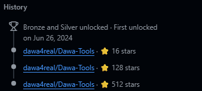

  

  

---

# ⚡ [ Status: Active ]
> **"Décortiquer le code et la cyber pour maîtriser chaque faille et devenir meilleur."**

* 🔴 **Focus :** Étudie l'informatique sous tous ses angles.
* 💀 **Specialty :** Pentesting & Sécurité offensive.
* 📈 **Legacy :** **512 stars** récoltées sur le projet *Dawa-Tools*.

---

# 🛠 Arsenal & Skills

  

---
# 🚀 Stars !

  

  

  <b>Record : 512 ⭐ sur Dawa-Tools (Legacy)</b>

